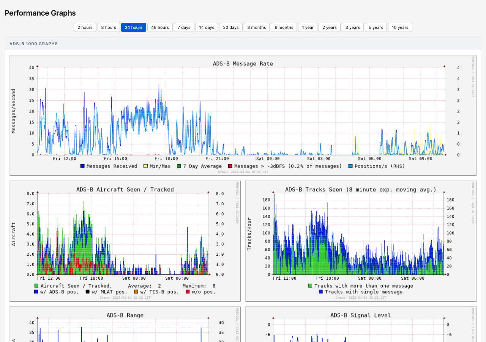

[](https://github.com/matsubo/graphs1090/releases)
[](LICENSE)
[](https://github.com/matsubo/graphs1090/issues)
[](https://github.com/matsubo/graphs1090/stargazers)



# graphs1090

Graphs for readsb (wiedehopf fork) and dump1090-fa, based on dump1090-tools by mutability.
Also works with other dump1090 variants that supply `stats.json`.

## Install and update

The same command installs and updates; it checks the remote version and skips if already current.

```
sudo bash -c "$(curl -L -o - https://github.com/matsubo/graphs1090/raw/master/install.sh)"
```

Force a reinstall regardless of version:

```
sudo bash -c "$(curl -L -o - https://github.com/matsubo/graphs1090/raw/master/install.sh)" bash reinstall
```

To install local changes, clone the repository, edit, then run `./install.sh test`.

> **Data loss:** graph data written after 23:42 of the previous day is lost on power loss.
> Run `sudo shutdown now` before unplugging. Reboots and shutdowns are safe.
> See [Reducing sd-card writes](#reducing-sd-card-writes).

## Viewing the graphs

Replace the IP address with that of your Raspberry Pi:

- <http://192.168.x.yy/graphs1090>
- <http://192.168.x.yy/perf>
- <http://192.168.x.yy:8542>

## Configuration

```
sudo nano /etc/default/graphs1090
```

Ctrl-x, then y and enter to save. Restart afterwards: `sudo systemctl restart graphs1090`.

Commonly changed options:

| Option | Default | Description |
| --- | --- | --- |
| `DRAW_INTERVAL` | `60` | Seconds between draws. Longer ranges are drawn at multiples of this (2h: 2x, 8h: 4x, 24h: 8x, 48h: 16x, 7d: 32x …). |
| `DRAW_ALL` | `no` | Draw every range on each interval instead of rotating through one range at a time. |
| `range` | `nautical` | Range graph unit: `nautical`, `statute`, or `metric`. |
| `range2` | `leftaxis` | Right axis unit: `leftaxis`, `nautical`, `statute`, or `metric`. |
| `colorscheme` | `default` | `default` or `dark`. |
| `graph_size` | `default` | `small`, `default`, `large`, `huge`, or `custom`. |
| `all_large` | `no` | Draw the small graphs at full size. |
| `font_size` | `10.0` | Relative to graph size. |
| `enable_scatter` | `yes` | Collect data for the scatter graphs. |
| `WWW_TITLE` | `graphs1090` | Browser tab title. |
| `WWW_HEADER` | `ADS-B Performance Graphs` | Heading shown on the page. |
| `export TZ=` | system timezone | Timezone used in the graphs, e.g. `export TZ=Europe/Berlin`. List names with `timedatectl list-timezones`. |

Custom y-axis limits, axis ratios and custom graph dimensions are also available — see the
[full option list](https://raw.githubusercontent.com/matsubo/graphs1090/master/default) for all of them.

### Redrawing every range (DRAW_ALL)

By default the service draws one range per interval on a doubling schedule, which assumes
`DRAW_INTERVAL` is short. With a long interval the rarely drawn ranges fall far behind — at
`DRAW_INTERVAL=86400` the 365d graph would only be redrawn every 1024 days.

Set `DRAW_ALL=yes` to draw every range on each interval instead. For one full refresh per day:

```
DRAW_INTERVAL=86400
DRAW_ALL=yes
```

In this mode the scatter data is refreshed as part of each sweep rather than at 00:07.

### Reset the configuration to defaults

```
sudo cp /usr/share/graphs1090/default-config /etc/default/graphs1090
```

## Troubleshooting

### The range graph isn't working

You need to configure the location in your decoder (dump1090-fa / readsb). These install scripts
provide a command line utility for it:

- <https://github.com/wiedehopf/adsb-scripts/wiki/Automatic-installation-for-readsb>
- <https://github.com/wiedehopf/adsb-scripts/wiki/Automatic-installation-for-dump1090-fa>

Otherwise edit `/etc/default/dump1090-fa` or `/etc/default/readsb` directly. On the piaware image,
set the location on the online FlightAware stats page. If you can't make it work, try <https://adsb.im>.

To include non-ADS-B positions (ADS-C, HFDL) in the range graph — rerun after each update:

```
sed -i -e 's/range_include_nonadsb = False/range_include_nonadsb = True/' /usr/share/graphs1090/dump1090.py
```

### collectd errors out on startup (Ubuntu 20, Linux Mint 20.1)

First try `sudo apt update && sudo apt dist-upgrade`. If that doesn't fix it:

```
# arm64 / aarch64
echo "LD_PRELOAD=/usr/lib/python3.8/config-3.8-aarch64-linux-gnu/libpython3.8.so" | sudo tee -a /etc/default/collectd

# x86_64
echo "LD_PRELOAD=/usr/lib/python3.8/config-3.8-x86_64-linux-gnu/libpython3.8.so" | sudo tee -a /etc/default/collectd

sudo systemctl restart collectd
```

Remove the workaround once your distribution ships a fix:

```
sudo sed -i -e 's#LD_PRELOAD=/usr/lib/python3.8.*##' /etc/default/collectd
sudo systemctl restart collectd
```

### Reporting issues

Include the output of these commands:

```
sudo systemctl restart collectd
sudo journalctl --no-pager -u collectd | tail -n40
sudo /usr/share/graphs1090/graphs1090.sh
sudo systemctl restart graphs1090
```

For 404s or pages not loading, also include:

```
sudo systemctl restart lighttpd
sudo journalctl --no-pager -u lighttpd
ls /etc/lighttpd/conf-enabled
```

Paste the output to <https://pastebin.com/>, then link it along with a description of the issue and
your system (debian / ubuntu / raspbian, RPi vs x86).

## Reducing sd-card writes

Enabled by default: the service keeps graph data in `/run` (memory) and only writes it to disk each
night, so up to 24h of data is lost on power loss. Reboots and shutdowns write the data out first
and reload it on boot.

To change how often data is written to disk, edit `/etc/cron.d/collectd_to_disk` — note that
running the install script resets this to the default:

```
# every day at 23:42
42 23 * * * root /bin/systemctl restart collectd

# every Sunday
42 23 * * 0 root /bin/systemctl restart collectd

# every 6 hours
42 */6 * * * root /bin/systemctl restart collectd
```

Disable and re-enable the behaviour:

```
sudo bash /usr/share/graphs1090/git/stopMalarky.sh
sudo bash /usr/share/graphs1090/git/malarky.sh
```

### System-wide alternative (if you disabled the above)

The rrd databases are written every minute, roughly 100 MB per hour. Linux flushes cached writes
after at most 30 seconds; raising that to 10 minutes cuts actual disk writes to around 10 MB per
hour. Don't do this if you keep data on the Pi you can't afford to lose the last 10 minutes of.

```
sudo tee /etc/sysctl.d/07-dirty.conf <<EOF
vm.dirty_ratio = 40
vm.dirty_background_ratio = 30
vm.dirty_expire_centisecs = 60000
EOF
```

Takes effect after reboot. Use `vm.dirty_expire_centisecs = 360000` for one hour instead.

## Backup and restore

### Same architecture

```
cd /var/lib/collectd/rrd
sudo systemctl stop collectd
sudo /usr/share/graphs1090/gunzip.sh /var/lib/collectd/rrd/localhost
sudo tar -cz -f rrd.tar.gz localhost
cp rrd.tar.gz /tmp
sudo systemctl restart collectd
```

Back up `/tmp/rrd.tar.gz`, for example with FileZilla over SSH/SCP.

To restore, install graphs1090 on the new card, copy the file back to `/tmp`, then:

```
sudo mkdir -p /var/lib/collectd/rrd/
cd /var/lib/collectd/rrd
sudo cp /tmp/rrd.tar.gz /var/lib/collectd/rrd/
sudo systemctl stop collectd
sudo /usr/share/graphs1090/gunzip.sh /var/lib/collectd/rrd/localhost
sudo tar -x -f rrd.tar.gz
sudo systemctl restart collectd graphs1090
```

### Moving from 32-bit to 64-bit

Between arm64 and amd64 the normal backup should work, but no guarantees. Run the install/update
script on **both** machines first, then dump the databases to XML:

```
sudo /usr/share/graphs1090/rrd-dump.sh /var/lib/collectd/rrd/localhost /tmp/xml.tar.gz
```

Copy `xml.tar.gz` to `/tmp` on the new machine and restore:

```
sudo /usr/share/graphs1090/rrd-restore.sh /tmp/xml.tar.gz /var/lib/collectd/rrd/localhost
```

### Automatic backups

With the write saving measures enabled (the default), backups for the last 8 weeks are kept.
This was introduced around 2021-08-07; older installs won't have them. List them with:

```
cd /var/lib/collectd/rrd
ls
```

Restoring a backup discards all data collected after it:

```
cd /var/lib/collectd/rrd
sudo systemctl stop collectd
sudo tar --overwrite -x -f auto-backup-2021-week_42.tar.gz
sudo systemctl restart collectd graphs1090
```

Choose the week you want — `42` in the example above.

### Integrating two data sets (experimental)

Results are not guaranteed and often differ from restoring a backup; using the old data outright is
often better. Back up the current data set first.

Put the old data in `/tmp/localhost` — from an automatic backup that is:

```
cp /var/lib/collectd/rrd/auto-backup-2021-week_42.tar.gz /tmp
cd /tmp
sudo tar --overwrite -x -f auto-backup-2021-week_42.tar.gz
```

Then:

```
sudo systemctl stop collectd
sudo /usr/share/graphs1090/gunzip.sh /var/lib/collectd/rrd/localhost
sudo /usr/share/graphs1090/rrd-integrate-old.sh /tmp/localhost
sudo systemctl restart collectd graphs1090
```

### Moving data to adsb.im

On the old install, update graphs1090 to the latest version, then:

```
sudo /usr/share/graphs1090/generate-adsb.im-backup.sh
```

Download the backup by appending `/graphs1090-to-adsb.im.backup` to the graphs URL, for example
`http://192.168.1.38/graphs1090/graphs1090-to-adsb.im.backup`.

On the adsb.im install, use System → Restore with that file. If the old system was 32-bit, update
adsb.im to beta before importing — that support is not in stable yet.

## Advanced

### Non-standard dump1090 URL

If your local map is not at `/dump1090-fa` or `/dump1090`, edit `/etc/collectd/collectd.conf` and
change the URL:

```
<Plugin python>
        ModulePath "/usr/share/graphs1090"
        LogTraces true
        Import "dump1090"
        <Module dump1090>
                <Instance localhost>
                        URL "http://localhost/dump1090-fa"
                </Instance>
        </Module>
</Plugin>
```

Then `sudo systemctl restart collectd`.

### Reading data without http

In `collectd.conf`:

```
  URL "file:///usr/local/share/dump1090-data"
```

```
sudo mkdir -p /usr/local/share/dump1090-data
sudo ln -s /run/dump1090-fa /usr/local/share/dump1090-data/data
```

### nginx

Add this line inside the `server { }` block of `/etc/nginx/sites-enabled/default` or
`/etc/nginx/conf.d/default.conf`, then restart nginx:

```
include /usr/share/graphs1090/nginx-graphs1090.conf;
```

### Hiding or showing the 1090 graphs

```
# Hide:
sudo sed -i -e 's/id="panel_1090" style="display:block"/id="panel_1090" style="display:none"/' /usr/share/graphs1090/html/index.html
# Show:
sudo sed -i -e 's/id="panel_1090" style="display:none"/id="panel_1090" style="display:block"/' /usr/share/graphs1090/html/index.html
```

### Removing UAT / 978 graphs and data

```
sudo systemctl stop collectd
sudo /usr/share/graphs1090/gunzip.sh /var/lib/collectd/rrd/localhost
sudo rm /var/lib/collectd/rrd/localhost/dump1090-localhost/*978*
sudo systemctl restart collectd graphs1090
```

### Adjusting gain

dump1090-fa and readsb adjust gain automatically, which is generally the better approach. If you
do want to tune it manually: <https://github.com/wiedehopf/adsb-scripts/wiki/Optimizing-gain>
(AGC is maximum gain and does not work as intended for ADS-B — many setups use far too much).

### Resetting the database format

This retains data but can cause anomalies — back up first. The script makes an automatic backup
too, but better that you know where yours is.

Useful if you switched from the adsb receiver project graphs and kept the data, if you upgraded
around 2019-07-15/16, or to allow storing more than 3 years of data on databases created before
2022-03-20.

```
sudo bash -c "$(curl -L -o - https://github.com/matsubo/graphs1090/raw/master/install.sh)"
sudo apt update
sudo apt install -y screen
sudo screen /usr/share/graphs1090/new-format.sh
```

### Wiping the database

Deletes **all** data:

```
sudo systemctl stop collectd
sudo rm /var/lib/collectd/rrd/localhost* -rf
sudo rm -f /var/lib/collectd/rrd/auto-backup-$(date +%Y-week_%V).tar.gz
sudo systemctl restart collectd graphs1090
```

## Uninstall

```
sudo bash /usr/share/graphs1090/uninstall.sh
```

## Releasing (maintainers)

```bash
./release.sh           # patch bump: 1.1.2 → 1.1.3
./release.sh --minor   # minor bump: 1.1.2 → 1.2.0
```
